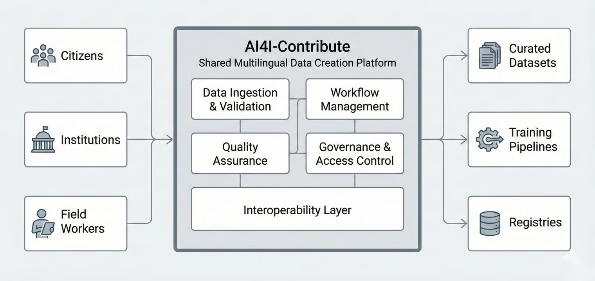

# Introduction

Language AI systems such as Automatic Speech Recognition (ASR), Neural Machine Translation (NMT), Text-to-Speech (TTS), Natural Language Understanding, and multimodal AI fundamentally depend on large volumes of high-quality, diverse, and representative datasets.

In multilingual and linguistically diverse regions such as India and many countries across Africa and Asia, building such datasets is both critical and challenging. Differences in scripts, dialects, accents, cultural expressions, code-mixing behavior, and domain usage significantly increase the complexity of data creation.

AI4I-Contribute is a foundational Digital Public Good (DPG) designed to address this challenge. It provides a standardized, scalable, and community-driven building block for data ingestion, annotation, validation, and quality assurance across speech, text, image, video, and multimodal datasets.

Contribute is designed to be reusable and interoperable across national and international Language AI ecosystems. Platforms such as Bhashini and programs like BhashaDaan (Suno, Bolo, Likho, Dekho) act as early adopters, demonstrating how Contribute can enable population-scale, inclusive, and responsible data creation.

<figure><figcaption></figcaption></figure>
